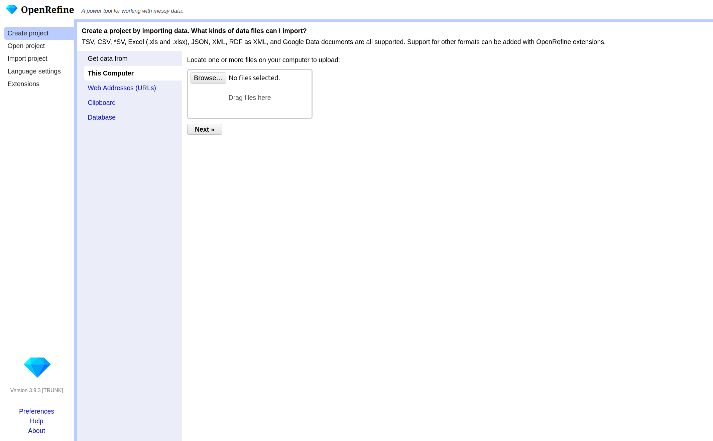
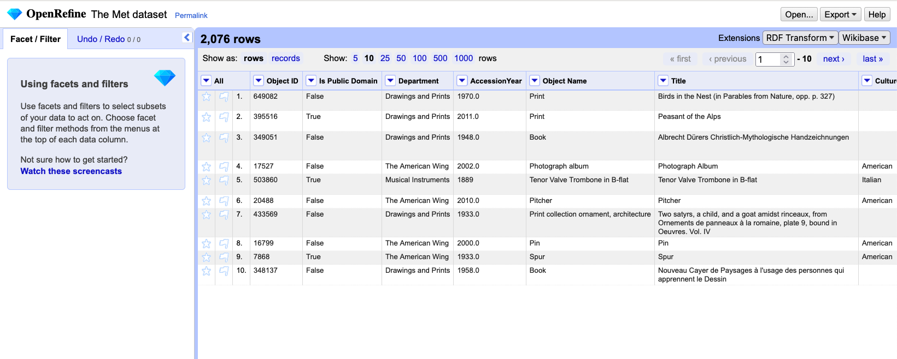

::::::::::::::::::::::::::::::::::::: questions

+ How do I start a new project in OpenRefine?
+ How do I import a CSV file?
+ What options and settings are available during import?
+ How is the user interface structured?

::::::::::::::::::::::::::::::::::::::::::::::::

::::::::::::::::::::::::::::::::::::: objectives

+ Create and configure a new OpenRefine project
+ Evaluate import settings using the preview pane and import a CSV file
+ Identify the core interface components and explain their functions

::::::::::::::::::::::::::::::::::::::::::::::::

## Importing Data

In this episode, you will import the Metropolitan Museum dataset used throughout the lesson. To begin, open OpenRefine.
When you start OpenRefine, a window in your web browser (at the address [http://127.0.0.1:3333/](http://127.0.0.1:3333/)) will open and you are greeted by the start page. 

There are various options in the left-hand bar. You can:

+ Create a new project and load data.
+ Open an existing project.
+ Import an existing project.
+ Change the language of OpenRefine. 
+ Manage extensions. 

:::::::::::::::::::::::::::::::::::::: instructor

If you have a non-English-speaking audience, you can point out the option to change the language of the user interface. However, this is not advisable for the workshop itself, as the explanations were written for the English user interface and it could otherwise be very confusing for the instructor and the audience. 

We will not be looking at extensions in this lesson, but they offer the possibility to customize OpenRefine in even greater detail and expand it with additional functions. Provide the link to the [OpenRefine extensions page](https://openrefine.org/extensions) if participants are interested in additional functionality.
   
:::::::::::::::::::::::::::::::::::::::::::::::::

OpenRefine structures your work in *projects*. To begin working, you first need to create a new project and import The Met dataset. If you pause your work on the project (the data and the changes you made) and want to continue later on, you can choose `Open project`. If a colleague sends you an OpenRefine project, you can import it under `Import project`.

1. Click on `Create Project` and then on *Get data from* `This Computer`. 
2. Here click on `Browse`, locate the dataset `met_dataset_oa.csv` on your computer and select it.
3. Click on `Next` and upload the data into OpenRefine.
4. On the next page OpenRefine will show you a preview of your data, allowing you to check that everything looks correct before you proceed.

Below the data preview, you find various import settings for how the data should be loaded. These settings have a direct effect on the preview above, allowing us to check immediately whether the settings have been selected correctly. This is especially important when files use non-standard formats, as incorrect settings may result in a distorted table structure.

:::::::::::::::::::::::::::::::::::::::::  callout

## What kinds of data files can I import?

There are several options for getting your dataset into OpenRefine. You can import files in a variety of formats including:

- Comma-separated values (CSV) or text-separated values (TSV)
- Text files
- JSON (javascript object notation)
- XML (extensible markup language)
- RDF (resource description framework)
- OpenDocument spreadsheet (ODS) or Excel spreadsheet (XLS or XLSX)

If needed, you can change the format on the left side under *Parse data as*. 
For more information see the [Create a project by importing data](https://docs.openrefine.org/manual/starting#create-a-project-by-importing-data) page in the OpenRefine manual.  

::::::::::::::::::::::::::::::::::::::::::::::::::

:::::::::::::::::::::::::::::::::::::::::::: challenge
## Challenge: Import as Interpretation
Let’s test how sensitive the import process is to incorrect settings. Try changing the separator to a semicolon.

In the import preview, change the column separator from comma to semicolon and observe the preview carefully.

**Questions:**

1. How does the table structure change?
2. How many columns are displayed now?
3. Why does this happen?
4. What would happen if you created the project without correcting this setting?

::::::::::::::::::: solution

### Solution
1. The table structure collapses.
2. Most or all values appear in a single column.
3. This happens because the dataset is comma-separated. When the separator does not match the file structure, OpenRefine cannot divide the data into columns correctly.
4. The dataset would be imported incorrectly, making further analysis difficult or impossible.

:::::::::::::::::::
::::::::::::::::::::::::::::::::::::::::::::

Sometimes, data files include extra header lines or notes at the top. You can tell OpenRefine to skip these lines, so only the actual data is imported.
For Excel files, you can select which sheet to import. For CSVs, you can preview and adjust how columns are interpreted. There are many different options depending on the file format and the dataset. In our case, the default settings are sufficient.

:::::::::::::::::::::::::::::::::::::::::  callout

## Why import settings matter?

Import settings determine how OpenRefine interprets your file and turns it into a table.
If these settings are incorrect, data may be split into the wrong columns, rows may be skipped, or values may be read incorrectly. Correct settings help prevent problems later in your workflow and save time. 

::::::::::::::::::::::::::::::::::::::::::::::::::

5. Once you are happy with the preview and settings, you can change your project name above the preview and click `Create Project`.
6. OpenRefine will load your data into its workspace on the next page. 

## Overview of the OpenRefine interface  

The OpenRefine interface is organized around a central workspace. The main window displays the data in a tabular format called the **grid**, with rows and columns similar to a spreadsheet: A row represents a record in your dataset, and every column represents a type of information. Above the table in the **grid header**, you can choose how many rows are shown at once, and you can scroll through the columns within the table.

:::::::::::::::::::::::::::::::::::::: instructor

The row/record distinction will be shown in the next [chapter](https://hermes-dkz.github.io/OpenRefine-humanities/aio.html#rows-records-and-multi-valued-cells). For now, you can treat one row as one record.
   
:::::::::::::::::::::::::::::::::::::::::::::::::

Each column header has a small `arrow`. Clicking this `arrow` opens a drop-down menu with actions that apply only to that column, such as sorting, faceting, and editing its values: These are the actions you will learn about in the following chapters

On the left-hand side, the `Facet/Filter` tab shows all active filters and facets. These tools allow you to explore the dataset and to see how your actions affect it. The `Undo/Redo` tab records every change you applied to the data. From here, you can step backward or forward through your changes. *Note: All changes are stored within the OpenRefine project; the original file remains unchanged.* You will use both tabs a lot in the following chapters.

Lastly, in the right corner of the **project bar**, the menu provides access to project-level actions. When you click on `Open...`, you return to the start page. The `Help` button links to the official OpenRefine documentation. If you encounter problems in the future, the official documentation is a useful starting point.

Now that we have successfully imported the dataset and understood the interface, we can begin exploring the data itself.

::::::::::::::::::::::::::::::::::::: keypoints

+ OpenRefine organizes your work in projects
+ You can import data from different sources and in different formats into OpenRefine
+ Adjust import settings to ensure your data is read correctly and preview the results before starting
+ The main components of the user interface are the grid, the grid header, the project bar, and `Facet/Filter` as well as `Undo/Redo` tab

::::::::::::::::::::::::::::::::::::::::::::::
